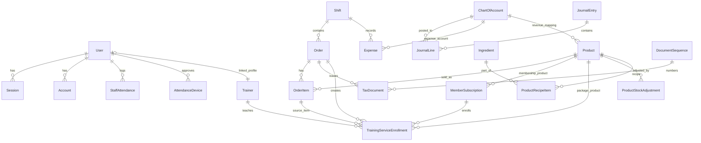

# Project Map: fitnessLA

Updated: 2026-03-23
Grounded from: repository structure, Prisma schema, README, API contract, recent commits, and handoff docs in this repo.

## Philosophy

fitnessLA คือระบบ frontdesk + POS + accounting สำหรับยิมที่วางแกนเป็น accounting-first operations:

- เงินสดหน้าร้านต้อง trace ได้ตั้งแต่เปิดกะจนปิดกะ
- การขายสินค้า, สมาชิก, และแพ็กเกจเทรนต้องลงบน backend truth ไม่ใช่ browser-local state
- role และ machine restrictions ต้องบังคับจากระบบจริง ไม่ใช่แค่ซ่อนปุ่มบน UI
- รายงาน, stock, attendance, และสมาชิก ต้องอิงฐานข้อมูลเดียวกันเพื่อคุม operational drift

## Current Operating Truth

- Runtime หลักใช้ Next.js App Router + Next API routes ใน repo เดียว
- Auth จริงใช้ Better Auth cookie session ผ่าน `src/app/api/auth/[...all]` และ `middleware.ts`
- Data layer หลักใช้ Prisma + PostgreSQL
- UI ยังมีทั้ง mock adapter และ real adapter แต่ current product direction คือ real-mode เป็น truth หลัก
- Domain ปัจจุบันไม่ได้มีแค่ POS/สมาชิกแล้ว แต่ขยายถึง attendance devices, trainer linkage, ingredient recipes, stock adjustments, และ training enrollments
- Recent commit signals บอกชัดว่าโปรเจกต์กำลังขยับจาก recovery mode ไปสู่ integrated operations mode

## Tech Stack

- Frontend: Next.js 16, React 19, Tailwind CSS
- Backend: Route Handlers ใน `src/app/api`, service modules ใน `src/features`
- Auth: Better Auth
- Database: Prisma + PostgreSQL
- State: Jotai สำหรับ POS/cart state และ React provider สำหรับ adapter/auth shell
- Validation: Zod usage ตาม route/service boundaries บางส่วน + contract-driven mapping
- Testing: Vitest + Playwright

## Key Landmarks

### Product Surface

- `src/app/(app)`
  - หน้าใช้งานหลักของระบบหลัง login
  - มี surface สำคัญ: `dashboard`, `pos`, `pos/products`, `members`, `trainers`, `expenses`, `coa`, `shift/open`, `shift/close`, `reports/*`, `admin/users`, `admin/attendance`
- `src/app/login/page.tsx`
  - จุดเข้าใช้งานของ auth flow
- `src/components/layout/app-shell.tsx`
  - navigation shell ที่เป็นตัวสะท้อน role-based product surface จริง

### API Surface

- `src/app/api/auth`
  - Better Auth routes และ current-session route
- `src/app/api/v1/shifts`
  - เปิดกะ, ปิดกะ, active shift, inventory summary
- `src/app/api/v1/orders`
  - POS checkout และ owner-level sale editing / deletion flows
- `src/app/api/v1/products`
  - catalog, create/update, stock adjustment, recipe binding, bulk delete
- `src/app/api/v1/members`
  - list, renew, restart, toggle active, special member flows
- `src/app/api/v1/trainers`
  - trainer CRUD, registered-user binding, training enrollments
- `src/app/api/v1/attendance`
  - check-in/check-out/status/device approval
- `src/app/api/v1/admin/users`
  - staff management และ attendance summary
- `src/app/api/v1/reports`
  - daily summary, shift summary, general ledger
- `src/app/api/v1/coa`, `expenses`, `ingredients`
  - operational master data และ supporting finance/POS flows

### Business Logic And Adapters

- `src/features/adapters/real-app-adapter.ts`
  - bridge หลักระหว่าง UI กับ API truth
- `src/features/adapters/mock-app-adapter.ts`
  - mock-mode fallback; เป็นจุดเสี่ยงเรื่อง drift ถ้า contract เปลี่ยนแต่ mock ไม่ตาม
- `src/features/operations/services.ts`
  - core POS/shift/accounting/stock behavior
- `src/features/staff/services.ts`
  - staff attendance, device approval, admin-user operations, trainer linkage บางส่วน
- `src/features/expenses`, `src/features/pos`, `src/features/auth`, `src/features/members`
  - domain-specific UI/service support modules

### Data And Contracts

- `prisma/schema.prisma`
  - source of truth ของ persistence model ปัจจุบัน
- `src/lib/contracts.ts`
  - frontend-facing domain contracts ที่ต้อง align กับ API reality
- `docs/API_Contract.md`
  - runtime-aligned contract document สำหรับ integration
- `docs/DatabaseSchema.md`
  - schema narrative ที่ควร sync กับ map นี้เมื่อ schema เปลี่ยน

### Testing And Operational Scripts

- `tests/backend`
  - route/service tests ของ finance, members, trainers, attendance, admin users, products
- `tests/frontend`
  - page and interaction coverage สำหรับ UI shells และ adapter alignment
- `tests/browser`
  - smoke/e2e flows สำหรับ auth, POS, attendance, trainer schedule, product management
- `scripts/full-smoke-test.mjs`
  - smoke orchestration ระดับระบบ
- `scripts/production-orders-smoke.mjs`
  - production-like order verification path
- `scripts/seed-real-mode.mjs`
  - baseline data สำหรับ local real-mode validation

### High-Value Docs

- `README.md`
  - current scope และ run order ที่อ่านง่ายที่สุดสำหรับเริ่มงาน
- `docs/Handoff_2026-03-22_Attendance_Device_And_POS_Changes.md`
  - สรุป attendance-device และ POS product changes ล่าสุด
- `docs/Smoke_Test_Report_2026-03-23.md`
  - หลักฐาน smoke รอบล่าสุด
- `docs/Local_Real_Mode_Runbook.md`
  - ขั้นตอนยืนยัน runtime จริง
- `docs/Phase_G_Smoke_Checklist.md`
  - regression surface สำคัญ

## Application Surfaces

### Human Roles

- `OWNER`
  - จัดการ staff, attendance devices, trainers, members, reports, products, COA
- `ADMIN`
  - ใช้งานหน้าร้านและงานจัดการบางส่วนตาม guard ที่เปิดไว้
- `CASHIER` หรือ `STAFF`
  - เน้น shift, POS, attendance

หมายเหตุ: schema ของ `User.role` ยังใช้ค่าฝั่ง persistence แบบ string และมีคอมเมนต์เก่าปะปน (`ADMIN`, `OWNER`, `STAFF`) ขณะที่ API contract หลายจุดพูดถึง `CASHIER`; จุดนี้ต้องตีความจาก runtime implementation ไม่ใช่ชื่อ enum ในเอกสารอย่างเดียว

### Major UI Areas

- Dashboard: login landing + attendance status + team summary
- Shift: open/close shift และ blind-drop cash flow
- POS: checkout, product browsing, stock-sensitive selling, membership/training package selling
- POS Products: product CRUD, stock adjustments, recipe management
- Members: subscription registry, renew/restart, activation control
- Trainers: trainer registry, optional user linkage, training enrollment flow
- Admin Users: staff provisioning, work schedule, attendance device approval, attendance history
- Reports: daily summary, shift summary, profit/loss, general ledger

## Data Flow

### Runtime Flow

1. Browser login ผ่าน Better Auth
2. `middleware.ts` + session helpers ตรวจ cookie/session ก่อนเข้า `(app)` routes
3. Page components เรียก adapter layer (`real-app-adapter` เป็น truth path หลัก)
4. Adapter ยิง `src/app/api/v1/*` พร้อม credentials ใน real mode
5. Route handlers ส่งต่อไป service layer ใน `src/features/*/services.ts`
6. Service layer ทำ validation, authorization, orchestration, และ Prisma writes/reads
7. Prisma commit ลง PostgreSQL แล้วตอบ DTO กลับขึ้นมา
8. Reports และ UI state อ่านข้อมูลจาก persistence truth ชุดเดียวกัน

### Operational Flow

- Shift open -> creates active cashier context
- Order checkout -> creates order/order items/tax docs and triggers stock/member/training/accounting side effects
- Expense posting -> records cash outflow against COA and shift
- Shift close -> computes expected vs actual cash and closes operational loop
- Attendance check-in/check-out -> writes staff attendance using approved device rules
- Admin user management -> controls who can operate and from which browser/device

## Database Schema

Schema ปัจจุบันแบ่งได้เป็น 7 กลุ่มโดเมนหลัก:

### 1. Identity And Access

- `User`
  - เก็บ identity หลัก, role, active flag, schedule time, allowed machine fields, optional trainer linkage
- `Session`, `Account`, `Verification`
  - Better Auth persistence tables

### 2. Accounting Core

- `ChartOfAccount`
  - ผังบัญชี, ใช้ทั้งกับ journal lines, expenses, product revenue mapping
- `JournalEntry` และ `JournalLine`
  - double-entry journal backbone
- `DocumentSequence`
  - running number สำหรับเอกสารภาษี

### 3. Shift And Cash Operations

- `Shift`
  - เปิด/ปิดกะ, starting cash, expected/actual cash, difference, responsible name
- `Expense`
  - petty cash / operational spending ที่ผูกกับ shift และ COA

### 4. POS Catalog And Inventory

- `Product`
  - goods/service/membership/training-package surface รวม field stock และ membership metadata
- `ProductStockAdjustment`
  - audit trail ของการเติม stock
- `PosCategory`
  - category master สำหรับ POS display
- `Ingredient` และ `ProductRecipeItem`
  - โครงสร้าง recipe/ingredient สำหรับสินค้าที่ประกอบจากวัตถุดิบ

### 5. Sales And Tax Documents

- `Order`
  - sale header ผูก shift และ payment method
- `OrderItem`
  - รายการสินค้าใน sale
- `TaxDocument`
  - invoice/receipt document ที่รันเลขผ่าน `DocumentSequence`

### 6. Membership And Training

- `MemberSubscription`
  - member registry + lifecycle ของ membership จริง
- `Trainer`
  - trainer registry และ optional binding ไป `User`
- `TrainingServiceEnrollment`
  - enrollment ของแพ็กเกจเทรน โดยผูกกับ order, order item, package product, trainer, member subscription
  - รองรับ `scheduleEntries` แบบ JSON สำหรับเก็บตารางนัด

### 7. Attendance Control

- `StaffAttendance`
  - attendance log ต่อ user/day พร้อม arrival/departure metrics
- `AttendanceDevice`
  - browser/device approval records ที่ owner อนุมัติให้ลงเวลาได้

### Core Relationships

- User -> many Sessions, Accounts, StaffAttendance, AttendanceDevices approved
- User -> optional one Trainer
- Shift -> many Orders, Expenses
- Order -> many OrderItems, TaxDocuments, TrainingServiceEnrollments
- Product -> many OrderItems, MemberSubscriptions, TrainingServiceEnrollments, RecipeItems, StockAdjustments
- ChartOfAccount -> many JournalLines, Expenses, Products
- JournalEntry -> many JournalLines
- MemberSubscription -> many TrainingServiceEnrollments
- Trainer -> many TrainingServiceEnrollments
- Ingredient -> many ProductRecipeItems

### ER Snapshot

## Testing And Verification Map

- Unit/integration truth อยู่ใน `tests/backend`
- UI contract alignment อยู่ใน `tests/frontend`
- browser truth อยู่ใน `tests/browser`
- commands สำคัญจาก `package.json`
  - `npm run build`
  - `npm run lint`
  - `npm run test`
  - `npm run test:browser:smoke`
  - `npm run test:browser:smoke:real-account`
  - `npm run db:seed:real-mode`

## Recent Change Signals

หลักฐานจาก commit ล่าสุดบน branch ปัจจุบัน:

- `2026-03-23` `fix: normalize runtime error handling`
  - แตะ `dashboard`, `admin/users`, `admin/attendance`, `real-app-adapter`, auth provider, utils
  - สัญญาณว่า runtime error surface และ adapter behavior ยังเป็น active stabilization zone
- `2026-03-23` `Add POS inventory role controls and production order smoke script`
  - ยืนยันว่า role-based control ใน POS products และ production-like smoke scripts เพิ่งขยาย
- `2026-03-23` `Add trainer user linkage and full smoke test report`
  - เพิ่ม trainer-user binding, training enrollment scheduling, smoke evidence, และ app-shell surface ใหม่
- `2026-03-23` `Add ingredient recipes and UI smoke coverage`
  - catalog domain ขยับจาก simple products ไปสู่ recipe-aware operations

สรุป: โปรเจกต์กำลังอยู่ในช่วง integrate หลาย domain เข้าหา runtime เดียว ไม่ใช่แค่ปิด recovery backlog แบบเดิมอีกแล้ว

## Challenges And Dragons

- Adapter Drift
  - mock adapter, real adapter, contracts, และ UI pages ต้อง sync กันตลอด ไม่งั้นหน้าเดียวกันจะมี behavior คนละ truth
- Role Semantics Drift
  - persistence role names, UI labels, guards, และ docs มีร่องรอยคำว่า `STAFF` กับ `CASHIER` ปะปนกันอยู่
- Attendance Device Rules
  - login ไม่ได้เท่ากับ check-in allowed; machine approval logic เป็นคนละชั้นกับ auth
- Accounting Atomicity
  - order, expense, stock, membership, training, และ journal side effects ต้องเป็น transactionally coherent โดยเฉพาะ checkout path
- Stock And Recipe Complexity
  - ตอนนี้มีทั้ง `stockOnHand` และ recipe graph; ต้องระวังไม่ให้ inventory semantics ซ้อนกันแบบไม่มี source of truth เดียว
- Migration Truth
  - repo นี้เพิ่ม migration ถี่มากในช่วงล่าสุด; ก่อนเชื่อ smoke result ต้องเช็ก migration state และ Prisma client generation เสมอ
- Report Reliability
  - reports ต้องอ่าน persistence truth เดียวกับ operations; ถ้า DTO drift จะพังแบบเงียบได้ง่าย
- Documentation Sync
  - `README.md`, `docs/API_Contract.md`, `docs/DatabaseSchema.md`, runbooks, และ map นี้ต้องขยับตาม schema และ role behavior ล่าสุดเสมอ

## Practical Grounding Notes

- ถ้าจะทำงานใน real mode ให้เริ่มจาก `README.md` + `docs/Local_Real_Mode_Runbook.md`
- ถ้าจะแก้ schema ให้ดู `prisma/schema.prisma` พร้อม migration ล่าสุดทั้ง `phase14`, `phase15`, และ `training_enrollment_schedule`
- ถ้าจะแก้ UI integration ให้เช็ก `src/features/adapters/real-app-adapter.ts`, `src/lib/contracts.ts`, และ test suites ที่เกี่ยวข้องพร้อมกัน
- ถ้าจะไล่ smoke failures ล่าสุด ให้เริ่มจาก `docs/Smoke_Test_Report_2026-03-23.md` และ `scripts/full-smoke-test.mjs`

## Suggested Next Action

ถ้าจะต่อจาก map นี้ในรอบ implementation ให้เปิด `/ppp` สำหรับ mission ถัดไป โดยแนะนำ candidate themes ตามความเสี่ยงปัจจุบัน:

- unify role semantics (`STAFF` vs `CASHIER`)
- lock down adapter/contract drift
- define inventory truth between stock adjustment and ingredient recipes
- consolidate trainer/member/training lifecycle rules